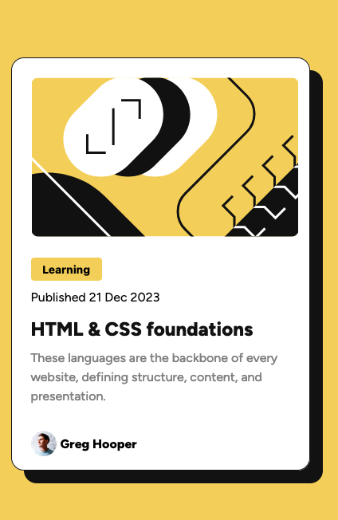

# Frontend Mentor - Blog preview card solution

This is a solution to the [Blog preview card challenge on Frontend Mentor](https://www.frontendmentor.io/challenges/blog-preview-card-ckPaj01IcS). Frontend Mentor challenges help you improve your coding skills by building realistic projects.

## Table of contents

- [Overview](#overview)
  - [The challenge](#the-challenge)
  - [Screenshot](#screenshot)
  - [Links](#links)
- [My process](#my-process)
  - [Built with](#built-with)
  - [What I learned](#what-i-learned)
  - [Continued development](#continued-development)
  - [Useful resources](#useful-resources)
- [Author](#author)
- [Acknowledgments](#acknowledgments)

## Overview

### The challenge

Users should be able to:

- See hover and focus states for all interactive elements on the page

### Screenshot



### Links

- Solution URL: [Blog Preview Card Challenge](https://www.frontendmentor.io/solutions/blog-preview-card-challenge-jj7qsyB0BS)
- Live Site URL: [Github Pages Site](https://craigwolfe.github.io/blog-review-card-challenge/)

## My process

### Built with

- Semantic HTML5 markup
- CSS custom properties
- Flexbox
- Mobile-first workflow

### What I learned

Use this section to recap over some of your major learnings while working through this project. Writing these out and providing code samples of areas you want to highlight is a great way to reinforce your own knowledge.

To see how you can add code snippets, see below:

```html
<section class="courseCreator">
  
  <p>Greg Hooper</p>
</section>
```

```css
.courseCreator img {
  width: 32px;
  height: 32px;
  justify-content: center;
  margin-right: 5px;
}
.courseCreator p {
  font-weight: 800;
  font-size: 1rem;
  align-self: center;
}
```

### Continued development

I definitely want to know as much about CSS Flexbox and Grid, JavaScript, React.

### Useful resources

- [CSS Matic Box Shadow Generator](https://www.cssmatic.com/box-shadow) - This helped me get the box shadow just right on the container.
- [HTMLColors.com](https://htmlcolors.com/hsl-to-hex) - I am not fond of using HSL color values. I would much rather use hexidecimal values.

## Author

- Frontend Mentor - [@craigwolfe(https://www.frontendmentor.io/profile/craigwolfe)

## Acknowledgments

Again I have to recognize Zach Goll for his great [Youtube](https://htmlcolors.com/hsl-to-hex) videos on CSS and JavaScript.
